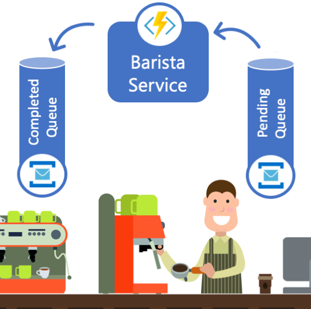
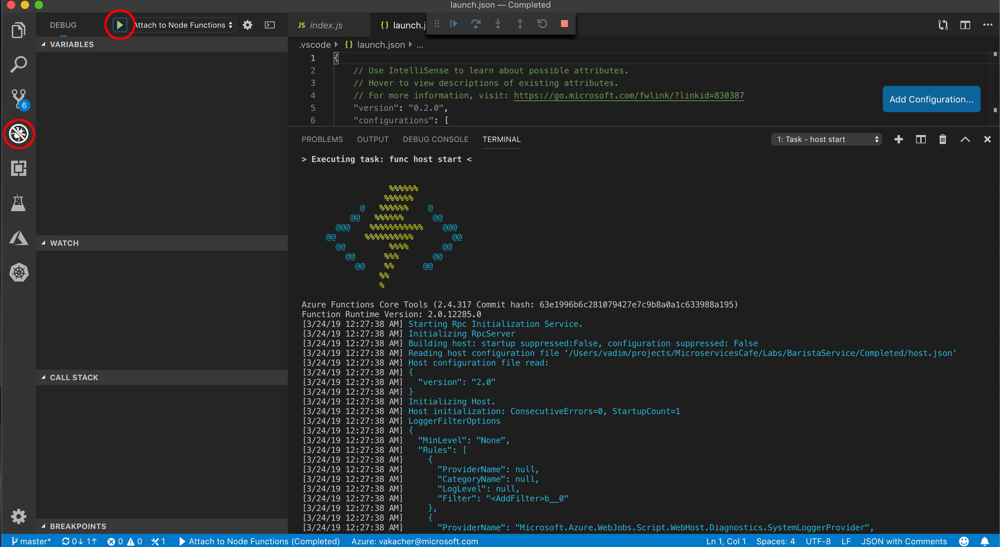
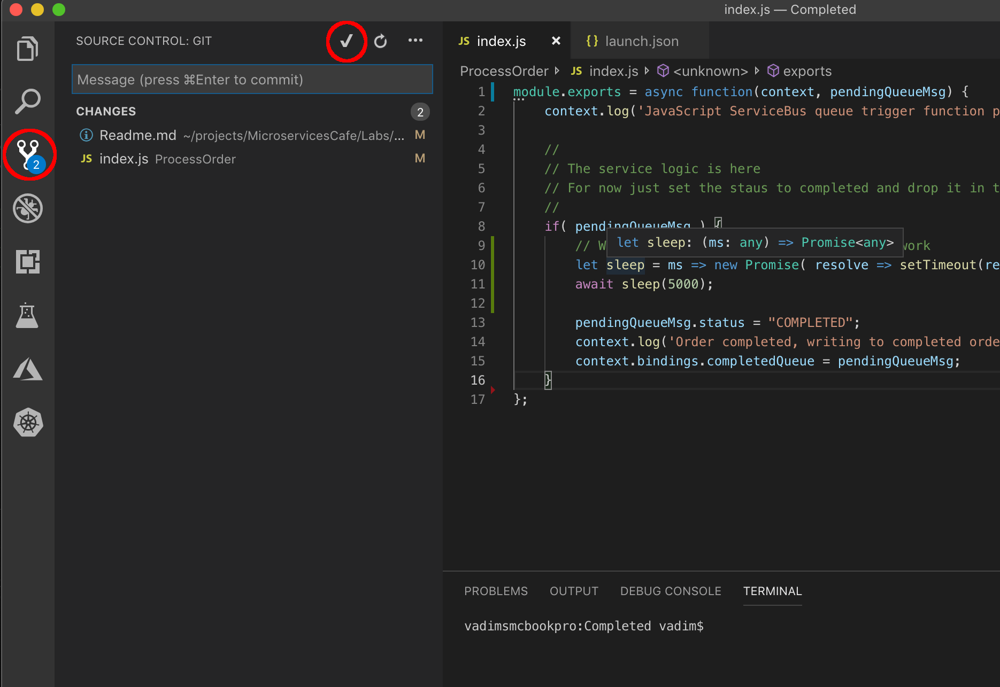

# Barista Service

  
  
  The Barista Service is responisble for consuming the orders from the "Pending Orders" queue, making the order and finally putting the completed orders in the "Completed Orders" queue. 
  The order message will adhere to the following minimum schema:

  ```
    {
        "name": "Joe",
        "phone": "(123)345-6789",
        "status": "COMPLETED"
    }
  ```  
## Core Technologies

* <a href="https://docs.microsoft.com/en-us/azure/service-bus-messaging/">Azure Service Bus</a>
* <a href="https://docs.microsoft.com/en-us/azure/azure-functions/">Azure Functions</a>
  
## Prerequisites

* <a href="https://code.visualstudio.com/download">Visual Studio Code</a> with Azure Functions extension (SDK) installed
  
## Step-by-step 
In this lab we will use the Azure Function App to implement the Barista Service. Azure Functions is a serverless compute service that enables you to run code on-demand without having to explicitly provision or manage infrastructure.

Begin by opening the Visual Studio Code in an empty directory. Bring up the command palette (Ctrl+Shift+P) and type "Functions", the command palette will filter the list to show available comands for Azure Functions.
* Select "Create Function..." command and select the local directory (default) to create your function app. Since there is no Function project created yet, you will be asked to initialize it, click "Yes".
* Next you will be asked to pick a language of choice, for this tutorial we will use JavaScript, but feel free to experiment with others. *Note: The code samples provided are JavaScript.* If you are prompted to select runtime, please pick Azure Functions v2.
* The Azure Functions platform offers many templates to get started, since we want our code to execute when the new coffee order is placed in the "Pending Orders" queue, we will use Azure Service Bus Queue trigger.
* Give your function a unique name (e.g. ProcessOrder or BaristaService)
* Now we need to specify the Service Bus service we will be working with. Select "+ New App Setting" and select the Service Bus name from the drop-down.
* Next we need to specify the Queue name we will be monitoring, select "pendingordersqueue".
* Lastly, you will be asked to select a Storage Account to use, select the default from the drop-down.


* We now have a basic function that will be triggered when there are new messages added to the "Panding Orders" queue. You can test your function by running it locally in the VS Code:



Next we will add the configuration for the "Completed Orders" queue:
* Open `function.json` file and add a new binding as follows
  ```
  {
      "name": "completedQueue",
      "type": "serviceBus",
      "direction": "out",
      "connection": "ORDER_QUEUE_CONNECTION",
      "queueName": "completedordersqueue"
  }
  ```
  *Note: Since we are using the same Service Bus for both queues ("completed" and "pending" orders), the connection setting will be the same for both.*
* We also need to configure the Service Bus trigger to immediately mark as complete. Open the `host.json` file and make sure `autoComplete: true`. Your file should look like this:
  ```
  {
    "version": "2.0",
    "extensions": {
          "serviceBus": {
              "prefetchCount": 100,
              "messageHandlerOptions": {
                  "autoComplete": true,
                  "maxConcurrentCalls": 32,
                  "maxAutoRenewDuration": "00:55:00"
              }
          }
      }
  }
  ```
* Now, let's add some logic to our Barista Service. Open the `index.js` and add some code to process the order, your file should look like the following:

  ```javascript
  module.exports = async function(context, pendingQueueMsg) {
      context.log('JavaScript ServiceBus queue trigger function processed message', pendingQueueMsg);

      //
      // The service logic is here 
      // For now just set the staus to completed and drop it in the completed queue
      //
      if( pendingQueueMsg ) {
          // Wait for 5s to simulate barista doing some work
          let sleep = ms => new Promise( resolve => setTimeout(resolve, ms));
          await sleep(5000);

          pendingQueueMsg.status = "COMPLETED";
          context.log('Order completed, writing to completed orders queue: '+ JSON.stringify(pendingQueueMsg));
          context.bindings.completedQueue = pendingQueueMsg;
      }
  };
  ```

* Test your function locally by submitting orders to the Cashier Service and monitoring the "Completed Orders" queue. There are a few ways to monitor the queue, you can either open the Service Bus Queue overview page in the [Azure portal](https://portal.azure.com) or use a [Service Bus Explorer](https://github.com/paolosalvatori/ServiceBusExplorer) tool (Windows only).

* Once the Barista Service is working locally as expected, we are ready to deploy it to Azure.
* Make sure your code is all checked into Git



* In VS Code, Bring up the command palette (Ctrl+Shift+P) and type "Functions", select "Deploy to Function App" and select folder containing the function code. 
* Select an existing Function App in Azure or click "+ Create New Function App" if you don't have one yet
* Set the language to JavaScript and runtime to Azure Functions v2 (.NET Standard) and click "Deploy". You can see the the deploy logs in the Output tab in VS Code (should popup by default).
* Once the Function has been deployed, you will be prompted to Stream Logs to VS Code, you will need to aggree to enable Application Logging, click "Yes".


* Well Done! Your Barista Service is now deployed to Azure and is ready to process orders. Test the service the same way we tested a local deployment.

## Next Steps

* <a href="/Labs/DispatcherService/Readme.md" class="myButton">Dispatcer Service and Azure Logic Apps</a>