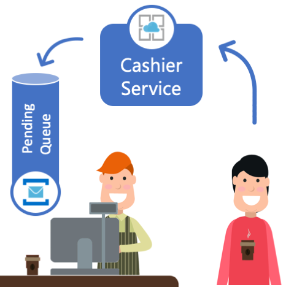
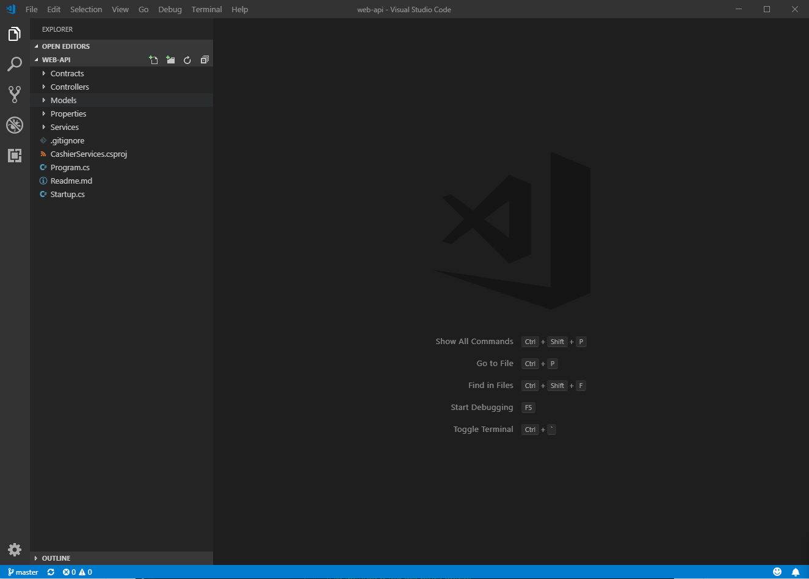
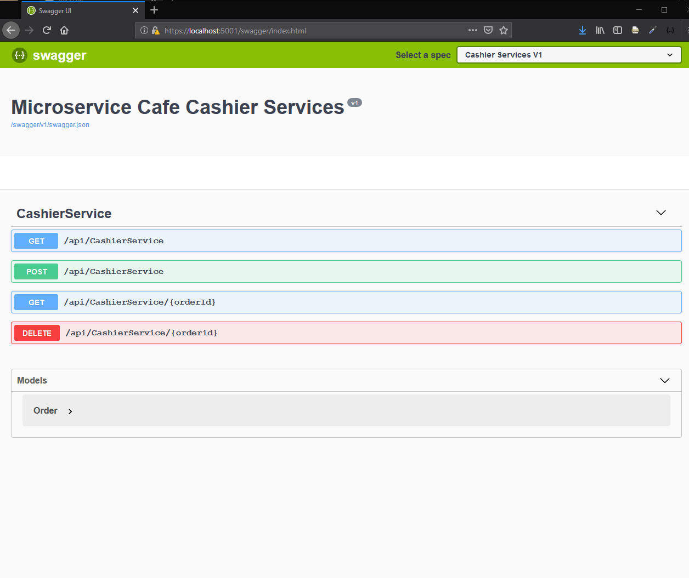
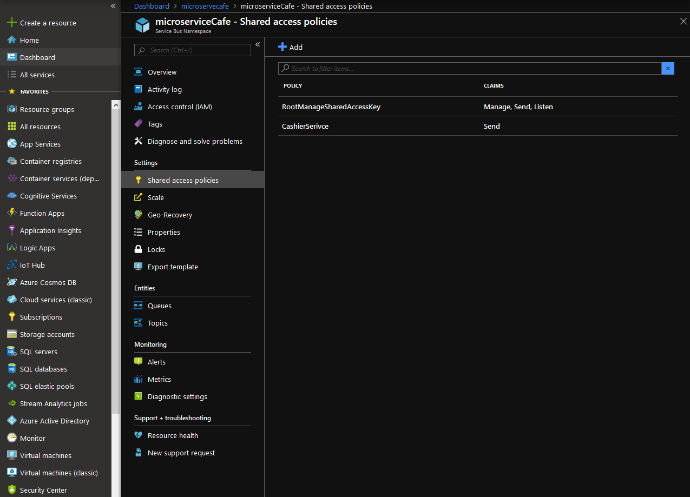
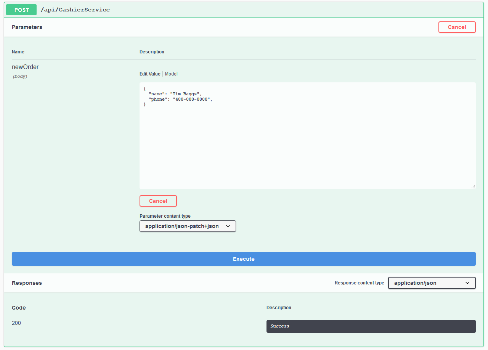
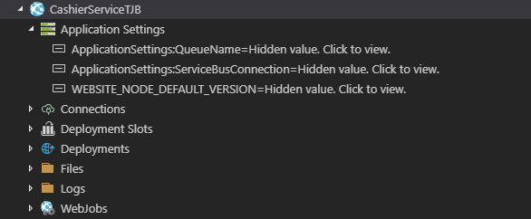
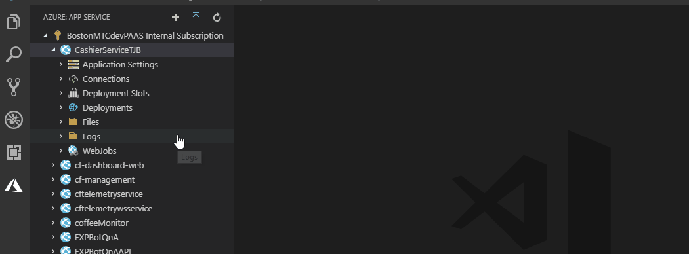
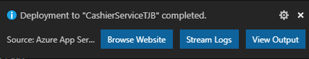

# Cashier Service

  
  
  The Cashier Service is responisble for recieving orders via a RESTful API endpoint `[POST]/api/CashierService` and storing the received orders in the "Pending Orders" queue. Each order in the pending queue should only be consumed and processed by a single Barista Service. 
  The order message will adhere to the following minimum schema:

  ```
    {
        "name": "Joe",
        "phone": "(123)345-6789"
    }
  ```  
## Core Technologies

* <a href="https://docs.microsoft.com/en-us/azure/service-bus-messaging">Azure Service Bus</a>
* <a href="https://docs.microsoft.com/en-us/azure/app-service">Azure App Services</a>
* <a href="https://docs.microsoft.com/en-us/dotnet/core/whats-new/dotnet-core-2-2">.Net Core 2.2</a>
* <a href="https://docs.microsoft.com/en-us/aspnet/core/tutorials/getting-started-with-swashbuckle?view=aspnetcore-2.2&tabs=visual-studio">Swashbuckle for OpenAPI</a>

## Prerequisites

* <a href="https://azure.microsoft.com/en-us/free/">Azure Subscription</a>
* <a href="https://code.visualstudio.com/download">Visual Studio Code</a>
* <a href="https://marketplace.visualstudio.com/items?itemName=ms-vscode.azure-account">Azure Account Extension for VSCode</a>
* <a href="https://marketplace.visualstudio.com/items?itemName=ms-azuretools.vscode-azureappservice">Azure App Service Extension for VSCode</a>
* <a href="https://marketplace.visualstudio.com/items?itemName=ms-vscode.csharp">C# Extension</a>

## Step-by-step 
In this lab we will build and deploy the Cashier Service to an Azure Web App.  

* In VSCode, open the ```web-api``` folder found under the Labs/CashierService. 
	* Note: VSCode may prompt you to restore packages associated with this service



* To verify everything is working, press F5 and start debugging. You should get a blank screen.  By adding /swagger to the end of the URL will give you the default swagger page.



* If you receive a certificate error, this can be corrected by trusting the dotnet core development cert.  Running the following command will add the certificate to your local certificate store.

	``` dotnet dev-certs https --trust ```

* Next, we'll add local settings files to allow for local debugging.
	* In VSCode, add the following 2 files to the CashierService web-api
		* appsettings.json
		* appsettings.Development.json

* Open the appsettings.json file and insert the following json:
```json
    {
      "ApplicationSettings": {
        "ServiceBusConnection": "PASTE SERVICE BUS CONNECTION STRING HERE",
        "QueueName": "PASTE SERVICE BUS QUEUE NAME HERE"
      },
      "Logging": {
        "LogLevel": {
          "Default": "Warning"
        }
      },
      "AllowedHosts": "*"
    }
```

   * Open the appsettings.Development.json file and insert the following json:
  
```json
    {
       "Logging": {
    	   "LogLevel": {
	    	"Default": "Debug",
    		"System": "Information",
    		"Microsoft": "Information"
	    }
	}
    }
```

* Now we need to replace our queue connection information with a Shared Access connection string from Azure Service Bus.  The creation of the Azure Service Bus Queues should have been completed in the Hands-on-Lab for <a href="./Labs/DeployQueues/Readme.md">Deploy Service Bus Queues</a> 



* Create a Shared access policy with Send claims and copy the connection string to your appsettings.json file.

* In the settings.json file, replace the QueueName with `pendingordersqueue`

* If all went well, you should be able to hit F5 and launch the api.  From the swagger screen you can post a new order to the service.



## Deploying to Azure

In this section we'll deploy our newly created service to a new Azure Web App.  We will be using the Azure CLI for this exercise.  It is also possible to perform this operation from the Azure Portal.

* Create an App Service plan in the FREE tier.

	``` az appservice plan create --name CashierServicePlan --resource-group microservicescafe --sku FREE -l eastus```

* Create the web app. Be sure to replace the ``` {initials} ``` with your initials in order to create a unique url for your web app.

	``` az webapp create --name CashierService{initials} --resource-group microservicescafe --plan CashierServicePlan -l ```
	
	* Note the -l parameter in this command.  This option will enable local git deploy which is what we'll be doing for this lab.  For production use, it is recommended to use a DevOps platform for deployment.

* Before we deploy our application, we need to set two application settings in our new Web App.  
	* Expand your Web App in Visual Studio Code.  You may need to refresh your subscription first if it doesn't appear.
	* Under Application Settings, add the following two keys with their corresponding values that we used earlier in our local appsettings.json file.

	```ApplicationSettings:QueueName```
	```ApplicationSettings:ServiceBusConnection```

	

* We are now ready to deploy our app to Azure. From Visual Studio Code, select the Azure App Service you are going to deploy to and then select the up arrow to begin the deployment.

	

	* If you encounter a deployment error due to CPU timeout, start your deployment again. 

* Once deployment is complete you will receive a confirmation in the bottom right hand side of Visual Studio Code similar to image below.  Select Browse Website to verify.  Make sure to include /swagger on the URL in order to get to the Swagger landing page.

	

## Next Steps

* <a href="/Labs/BaristaService/Readme.md" class="myButton">Barista Service and Azure Functions</a>
  


