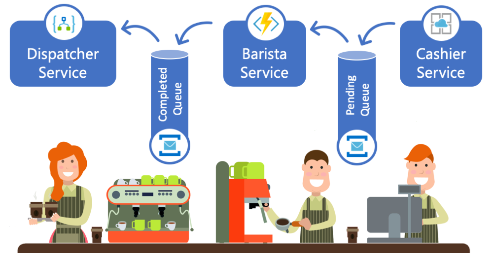

# Deploying Queues

  
  
  The Microservice Cafe implentation follows a microservices architecture and utilizes Azure Service Bus Queues to exchange messages between the different services.

## Core Technologies

* <a href="https://docs.microsoft.com/en-us/azure/service-bus-messaging">Azure Service Bus</a>
* <a href="https://docs.microsoft.com/en-us/cli/azure/install-azure-cli?view=azure-cli-latest">Azure CLI</a>
  
## Step-by-step 

* We will using the Azure CLI to create the required Azure resources. We will use [Cloud Shell](shell.azure.com) for this. Open a new C;oud Shell session by navigating to http://shell.azure.com in your favorite browser. **Note:** If this is your first time in the Cloud Shell you will be prompted to create a storage account.
  
* Verify that the Azure CLI is installed by running:
   ```
  az version
  ```
* Now let's set some environment variable that we will use later

  ```
  RESOURCE_GROUP=misroservicesCafe
  YOUR_UNIQUE_ID={replace with your id}
  ```
* Optionaly, if you are familiar with Linux text editors (e.g. vi), you can set this envronment variable permanent by adding it to `.profile` file in your home directory 
 
* If the CLI is installed, we will need to login the CLI into your Azure subscription. Follow the prompts after running the `login` command
  ```
  az login
  ```
 * If you have more than one subscription, the command below will allow you to set a specific subscription to deploy new resources.
   ```
   az account set --subscription {subscription id or name}
   ```
* Create the resource group that we will use to group all resources in this lab
  ```
  az group create -n $RESOURCE_GROUP -l eastus
  ```
* Create a Service Namespace
  ```
  az servicebus namespace create --resource-group $RESOURCE_GROUP --name microservicescafe \
      --location eastus --sku Standard
  ```
* Now that we have a namespace lets create the "Pending Orders" and "Completed Orders" queues
  ```
  az servicebus queue create --resource-group $RESOURCE_GROUP --namespace-name microservicescafe \
      --name pendingorders
  az servicebus queue create --resource-group $RESOURCE_GROUP --namespace-name microservicescafe \
      --name completedorders
  ``` 
* Lastly, we need to retrive a connection string for our newly created Azure Service Bus, we will need it later.
  ```
  az servicebus namespace authorization-rule keys list --resource-group $RESOURCE_GROUP \
      --namespace-name microservicescafe -n RootManageSharedAccessKey
  ```

## Next Steps

* <a href="/Labs/CashierService/Readme.md" class="myButton">Cashier Service and Azure App Services</a>
  
