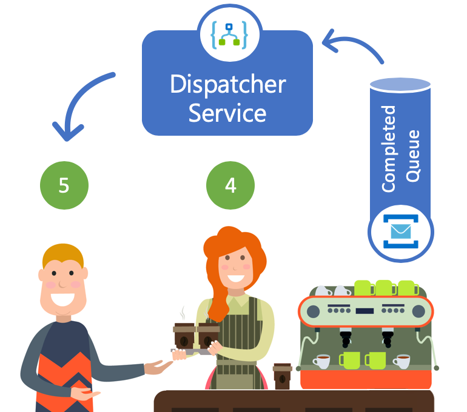
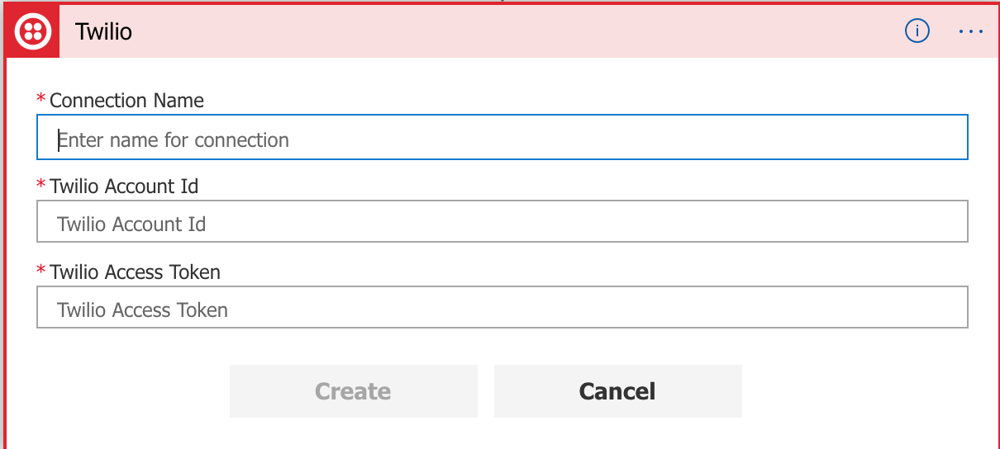

# Dispatcher Service

  
  
  The Dispatcher Service consumes the "Completed Orders" queue and is responsible for notifiying the customers by sending an SMS text message. Each order in the completed queue should only be consumed and processed by a single Dispatcher.

## Core Technologies

* <a href="https://docs.microsoft.com/en-us/azure/service-bus-messaging">Azure Service Bus</a>
* <a href="https://docs.microsoft.com/en-us/azure/logic-apps">Azure Logic Apps</a>
* <a href="https://www.twilio.com">Twillio</a>

## Prerequisites

* Twilio Account
  
  * You will need a <a href='https://www.twilio.com/'>Twilio account</a> ID and authentication token, which you can find on your Twilio dashboard

  * Your credentials authorize your logic app to create a connection and access your Twilio account from your logic app. If you're using a Twilio trial account, you can send SMS only to verified phone numbers.

  * A verified Twilio phone number that can send SMS

  * A verified Twilio phone number that can receive SMS
  
## Step-by-step 

In this lab we will use the Azure Logic App to implement the Dispatcher Service. Azure Logic Apps is a cloud service that helps you automate and orchestrate tasks, business processes, and workflows.

- Begin by navigating to the [Azure portal]('https://portal.azure.com') and sign in.
- Onced in the portal, click on the Create Resource button &nbsp;&nbsp;  in the left-side control panel.
- Type in "Logic App" in the search field and click enter. Click the "Create" button at the bottom of the Logic App blade and fillout the required fields: Name, Subscription, Resource Group (select "Use Existing" to keep all lab resource together) and Location and click create.
   


- Now that we have a Logic App, let's create a flow that will be triggered by a new message arriving in the "CompletedOrdersQueue" and send an SMS message to the user.  
  - Select "When a messge is received in a Service Bus queue" card on the Logic Apps Designer screen. 
  - Configure the Service Bus connector task by selecting the "completedordersqueue" from dropdown and changing the polling time to 3 seconds.
  - Add a task to decode and parse the Service Bus message by searching for "Parse JSON" and adding "Dynamic Content" Expression of `base64toString(Content)`
  - Add the schema by using the following sample payload
  ```
    {
        "name": "Joe",
        "phone": "(123)345-6789",
        "status": "COMPLETED"
    }
  ```
  - In this step we will configure a task to send an SMS text message back to the customer using [Twilio](http://twilio.com) plugin. Add a Twilio task for "Sending a text message (SMS)".
  - You will be required to create a new connection to your Twilio account. Give it a unique name and Twilio Account ID/Token (from the [Twilio](http://twilio.com) portal):
  
  
  - Use the Dynamic Content helper to inject name and phone number.
  - Click Save, your Logic App Flow is now ready to process requests.  


  - We can test the whole system by submitting a message to the Cashier Service. If everything is working as expected you should you recieve an SMS message notifying you that the order is complete.
  
## Next Steps

* <a href="/Labs/OptionalExercises/Readme.md" class="myButton">Optional Exercises</a>
