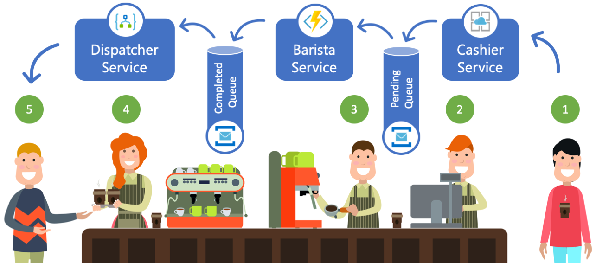

# Microservices Cafe

## Introduction

This workshop aims to introduce participants to the main concepts of a Microservices Architecture, Azure Serverless and Azure PaaS Services. You will work through an example of deploying a microservices application that simulates a process of ordering a cup coffee from your favorite coffee house. 

During this lab you will deploy and use and number of Azure PaaS and Serverless services, you will create and deploy a number of microservices, configure and combine the services into a working end to end application. Finally you will look at how Azure Services can be used to make the application resilient and scalable.

The application you will be building will allow the users to order a cup of coffee from a fictional coffee house called Microservices Cafe. A set of microservices comprising this Microservices Cafe application will capture the order via a [RESTful API](https://docs.microsoft.com/en-us/azure/architecture/best-practices/api-design), simulate the process of making the order and finally dispatching the order by notifying the user via an SMS text message. 

## Core Technologies

* Azure App Service (PaaS)
* Azure Functions (Serverless)
* Azure Logic Apps (Serverless)
* Azure Service Bus (PaaS)

## Architecture

## Pre-Reqs
There are several things you will need before starting this lab:

* Azure Subscription 
Either an existing Azure subscription you have access to (with ‘contributor’ rights) or Azure Pass or free account. 
**Note:** If you activate an Azure Pass do not use your company/work email address

* Visual Studio Code
* Azure CLI

## Hands-on Labs

* <a href="./Labs/DeployQueues/Readme.md" class="myButton" style="disabled">Deploy Service Bus Queues</a>

* <a href="./Labs/CashierService/Readme.md" class="myButton">Cashier Service and Azure App Services</a>

* <a href="./Labs/BaristaService/Readme.md" class="myButton">Barista Service and Azure Functions</a>

* <a href="./Labs/DispatcherService/Readme.md" class="myButton">Dispatcer Service and Azure Logic Apps</a>

* <a href="./Labs/OptionalExersices/Readme.md" class="myButton">Optional Exercises</a>
